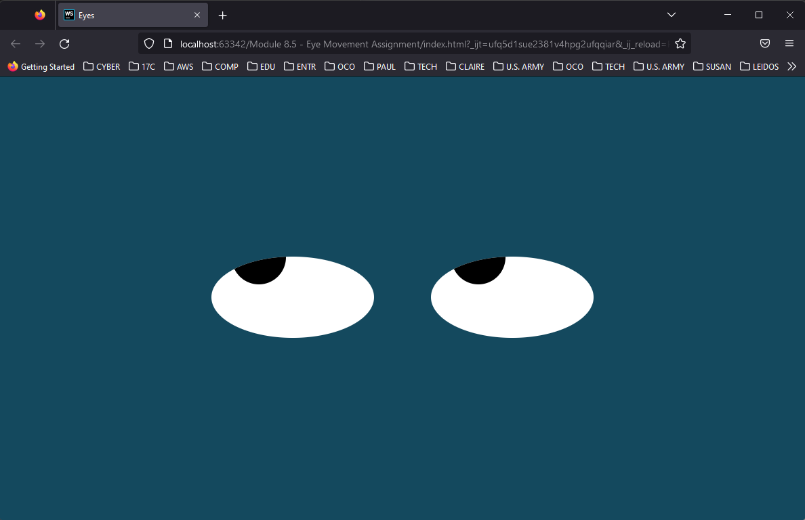

# Eye Exercise:



## Learning Outcome Addressed:

* Use ```JavaScript``` to set **web page styles**.

## Follow Mouse Movement:

In ```JavaScript```, ```events``` are **actions** that happen on a **web page**. They **can be anything** from a **mouse moving** to a user **typing in** some text. ```Events``` happen to **most elements** on the **DOM**. These ```events``` are a **good way** to **bind a code** to **user actions**. For example, consider a **web page** that has a **form** with a **"Submit" button**. You can **bind** the **mouse button click** to that **button** and **submit** the **form data** upon that **click**.

```Mouse events``` are a popular way to **bind** the **DOM elements** to **events**. Some of **these events** are as follows:

* ```click```: Triggered when the **mouse is clicked**
* ```mousemove```: Triggered when the **mouse moves over an element**
* ```mouseleave```: Triggered when **mouse the leaves an element**

In the **starter code** for this activity, the **mouse movement** ```event``` is used to **update the position** of the ```"eye" element``` displayed on the page. You can walk through the code to see how this all works.

You task is to add a second "eye" element and have that element follow the mouse position on the screen using the mouse events.

## Solution:

### CSS Code:

```css
body {
    margin: 0;
    padding: 0;
    background: #14495e;
}

.eyes {
    position: absolute;
    top: 50%;
    transform: translateY(-50%);
    width: 100%;
    text-align: center;
}
.eye {
    width: 240px;
    height: 120px;
    background: #fff;
    display: inline-block;
    margin: 40px;
    border-radius: 50%;
    position: relative;
    overflow: hidden;
}
.ball {
    width: 80px;
    height: 80px;
    background: #000;
    position: absolute;
    top: 50%;
    left: 50%;
    transform: translate(-50%, -50%);
    border-radius: 50%;
}

```

### HTML Code:

```html
<html>
    <head>
        <link rel="stylesheet" type="text/css" href="./styles.css">
        <title>Eyes</title>
    </head>

    <body>
        <div class="eyes">
            <div class="eye">
                <div class="ball"></div>
            </div>

            <div class="eye">
                <div class="ball"></div>
            </div>
        </div>
        <script src="./eyes.js"></script>
    </body>
</html>
```

### JavaScript Code:

```javascript
const balls = document.getElementsByClassName('ball');

document.onmousemove = (event) => {
    const x = (event.clientX * 100) / window.innerWidth + '%';
    const y = (event.clientY * 100) / window.innerHeight + '%';

    for (let i=0; i<2; i++) {
        balls[i].style.left = x;
        balls[i].style.top = y;
        balls[i].transform = 'translate(-' + x + ',-' + y + ')';
    }
};
```

### Web Output:

