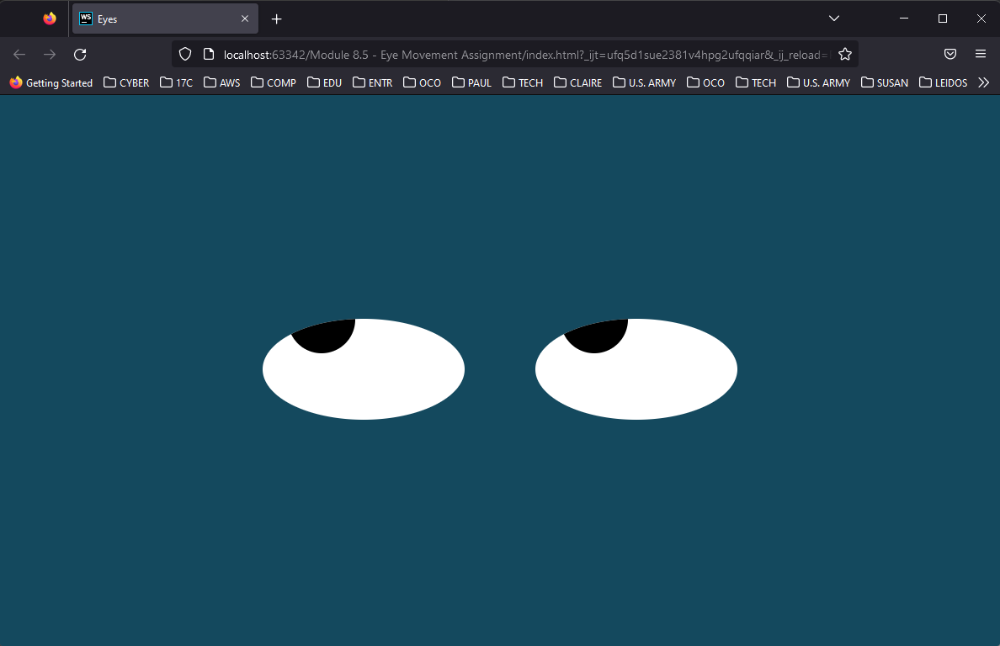

# Eye Exercise:



## I. Project Description:

This project demonstrates an important concept used frequently in ```JavaScript``` called ```events```.  In ```JavaScript```, ```events``` are **actions** that happen on a **web page**. They **can be anything** from a **mouse moving** to a user **typing in** some text. ```Events``` happen to **most elements** on the **DOM**. These ```events``` are a **good way** to **bind a code** to **user actions**. For example, consider a **web page** that has a **form** with a **"Submit" button**. You can **bind** the **mouse button click** to that **button** and **submit** the **form data** upon that **click**.

```Mouse events``` are a popular way to **bind** the **DOM elements** to **events**. Some of **these events** are as follows:

* ```click```: Triggered when the **mouse is clicked**
* ```mousemove```: Triggered when the **mouse moves over an element**
* ```mouseleave```: Triggered when **mouse the leaves an element**

This program makes use of the elements as shown above by making the eyes follow the mouse movement of the user. The **mouse movement** ```event``` is used to **update the position** of the ```"eye" element``` displayed on the page. 


## II. How to Run:

The first step would be to fork the repository to your own GitHub account.

The next step would be to **clone the repository** to your local machine by going to the **Project's ReadMe Page** and selecting ```<> Code``` and copy the **project URL**.

Cloning your own repository would depend on your local machine's **Operating System (OS)** whether it be ```Windows```, ```Mac```, or ```Linux```. Some of the steps or commands may vary but there are some similarities. Here is an overall guide based on an article posted in GitHub Docs.

[Cloning a repository](https://docs.github.com/en/repositories/creating-and-managing-repositories/cloning-a-repository?platform=linux)

After **cloning the repository** navigate to the **directory location** of the files for the project. Look for the ```index.html``` file which is the HTML file of the program. Open any web browser such as ```Chrome``` or ```Firefox``` and drag and drop the ```index.html``` file into the browser. This initializes and runs the program.

Simply move the mouse pointer across the web page and observe that the eye follows the movememnt of the mouse. To close the program just close the web browser running the application.

https://user-images.githubusercontent.com/88525094/210278688-4a00931d-b6ff-4736-823c-a599a712887d.mp4

Make sure also that the ```eyes.js``` file is in the same directory of the ```index.html``` file for the program to work.

## III. Roadmap for future improvements:

At the moment there is not much I'm thinking to improve on this project cause it simply demonstrates the use of mouse events to trigger an action. Such as the eyes following the mouse movement. But I can perhaps enhance and improve the graphics by adding some kinds of animation like making the eyes blink or adding a face instead of just the eye, or even a menu to select which kind of face to display from animals, to objects, persons or a mythological creature.

I'm also thinking of adding some audio to make the graphics more interesting.

## IV. License Information:

The following [document](./LICENSE) shows licensing information from MIT about the free open source code of the program.
